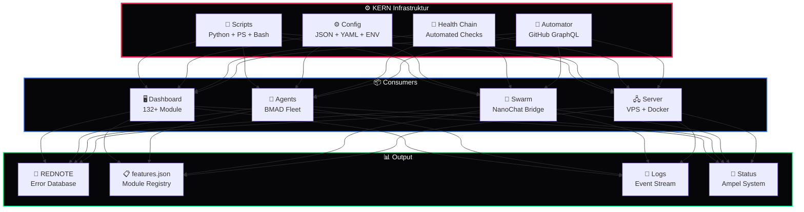

<div align="center">

# ⚙️ KERN

### Kern-Infrastruktur · Config · Scripts · System-Tools · Health Chain

*Das Fundament des DEVKiTZ™ Ökosystems — Shared Scripts, Konfiguration, Build-Tools, Automations-Utilities und System-Überwachung*

---


</div>

---

## 📖 Überblick

**KERN** ist die zentrale Infrastruktur-Schicht des DEVKiTZ™ Ökosystems. Hier liegen alle System-Scripts, Konfigurationsdateien, Health-Check-Ketten, Build-Tools und Automations-Utilities, die von allen anderen Repos und Modulen benötigt werden.

> **Kernprinzip:** Eine zentrale Quelle der Wahrheit für Konfiguration, Scripts und System-Zustand. Alles was das Dashboard, die Agenten und die Server brauchen, kommt aus KERN.

---

## 🏛️ Architektur



---

## 📜 Script-Katalog

### System-Scripts

| Script | Sprache | Zweck | Trigger |
|:-------|:--------|:------|:--------|
| `health-check-chain.py` | Python | 12-Stufen System-Prüfungskette | Startup / Cron |
| `rednote-collector.js` | Node.js | Zentrale Fehler-Datenbank Manager CLI | Bei Fehler |
| `dkz-project-automator.py` | Python | GitHub Projects v2 Automatisierung via GraphQL | Webhook / CLI |
| `deploy-readmes.ps1` | PowerShell | README Deployment für alle Repos | Manuell |

### Health-Check Chain

| Stufe | Prüfung | Erwartung | Bei Fehler |
|:------|:--------|:----------|:-----------|
| 1 | Node.js Version | ≥ 18.0 | `🔴 ALARM` |
| 2 | Git Status | Clean | `🟡 Warning` |
| 3 | Shared Scripts | Alle vorhanden | `🔴 ALARM` |
| 4 | features.json | Valid JSON | `🔴 ALARM` |
| 5 | Module Count | ≥ 130 | `🟡 Warning` |
| 6 | NanoChat Bridge | Port 3040 | `🟡 Degraded` |
| 7 | REDNOTE.json | Keine Critical | `🔴 ALARM` |
| 8 | localStorage | Accessible | `🟡 Warning` |
| 9 | GitHub API | Token valid | `🟡 Degraded` |
| 10 | Docker Services | Running | `🟡 Degraded` |
| 11 | Disk Space | > 10% free | `🔴 ALARM` |
| 12 | Last Commit | < 24h | `🟡 Warning` |

### Ampel-System

```
🟢 GRÜN    = Alle 12 Checks OK
🟡 GELB    = 1-3 Warnings (System läuft, aber degraded)
🔴 ROT     = Critical Error (Sofortmaßnahme erforderlich)
```

---

## 🔴 REDNOTE — Fehler-Datenbank

Zentrales Error-Tracking für das gesamte Ökosystem:

```json
{
  "id": "RN-2026-0528-001",
  "severity": "critical",
  "module": "nanobot-center",
  "error": "WebSocket connection refused",
  "timestamp": "2026-05-28T16:00:00Z",
  "resolved": false,
  "agent": "antigravity"
}
```

| Severity | Beschreibung | Aktion |
|:---------|:-------------|:-------|
| `critical` | System-Ausfall | Sofort-Fix, R24 ALARM |
| `warning` | Degraded Mode | Nächster Sprint |
| `info` | Hinweis | Dokumentieren |

---

## 🤖 GitHub Project Automator

Automatisierte Kanban-Verwaltung über GitHub GraphQL API:

```bash
# Neuen Task hinzufügen
python dkz-project-automator.py add --project 5 --title "Feature X"

# Issue erstellen + verlinken
python dkz-project-automator.py issue --repo dashboard --title "Bug Y"

# Status-Update
python dkz-project-automator.py status --project 5

# Webhook-Server starten
python dkz-project-automator.py serve --port 8080
```

---

## 📁 Struktur

```
KERN/
├── README.md                    # Diese Datei
├── scripts/                     # System-Scripts
│   ├── health-check-chain.py    # 12-Stufen Health Check
│   ├── rednote-collector.js     # Fehler-DB Manager
│   ├── dkz-project-automator.py # GitHub Projects API
│   └── deploy-readmes.ps1       # README Deployer
├── config/                      # Zentrale Konfiguration
│   ├── ecosystem.json           # Ökosystem-Einstellungen
│   ├── agents.json              # Agent-Definitionen
│   └── servers.json             # VPS-Konfiguration
├── templates/                   # Vorlagen
│   ├── module-template/         # Neues Modul Boilerplate
│   └── readme-template.md       # README Vorlage
└── docs/                        # Dokumentation
    ├── architecture.md          # System-Architektur
    └── runbook.md               # Operations-Handbuch
```

---

## 🔗 Ökosystem-Links

| Resource | Beschreibung | Link |
|:---------|:-------------|:-----|
| 🏠 **Dashboard** | 132+ Module Frontend | [D-VKITZ.github.io](https://github.com/D-VKITZ/D-VKITZ.github.io) |
| 🤖 **BMAD™** | 7-Agenten Framework | [bmad-framework](https://github.com/D-VKITZ/bmad-framework) |
| 🤖 **Agent Swarm™** | Multi-Agent Orchestrierung | [agent-swarm](https://github.com/D-VKITZ/agent-swarm) |
| 💻 **BB-Terminal** | Browser Terminal | [BB-Terminal](https://github.com/D-VKITZ/BB-Terminal) |
| 📊 **Projects** | 12 Kanban Boards | [GitHub Projects](https://github.com/orgs/D-VKITZ/projects) |

---

<div align="center">

*Teil des [DEVKiTZ™](https://github.com/D-VKITZ) Ökosystems · Made with ❤️ by 777*

</div>